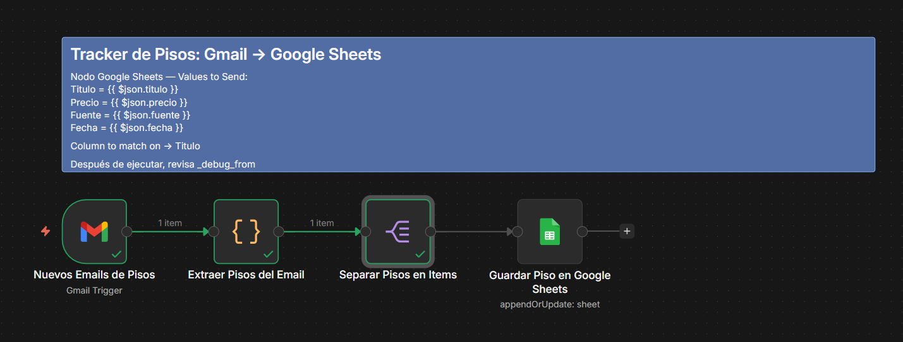

# 🏠 Tracker de Pisos — Gmail → Google Sheets

Automatización que monitorea tu Gmail cada hora en busca de alertas de portales inmobiliarios, extrae la información de cada piso y la guarda en Google Sheets sin duplicados.



---

## Workflow Overview

Este workflow resuelve el problema de hacer seguimiento manual de pisos en venta. En lugar de revisar correo por correo, el workflow corre automáticamente cada hora, analiza los emails de Fotocasa, Idealista y Yaencontre, extrae los datos estructurados de cada propiedad y los consolida en una hoja de cálculo organizada.

**Portales soportados:**
- [Fotocasa](https://www.fotocasa.es) — `enviosfotocasa@fotocasa.es`
- [Idealista](https://www.idealista.com) — `news@diario.idealista.com`
- [Yaencontre](https://www.yaencontre.com) — `no-reply@envios.yaencontre.com`

---

## Block-by-Block Analysis

### Bloque 1 — `Nuevos Emails de Pisos` (Gmail Trigger)
**Tipo:** `n8n-nodes-base.gmailTrigger` v1.3

Trigger que se ejecuta **cada hora** mediante polling. Busca en Gmail correos de los tres portales usando un filtro combinado con operadores `OR`. Recupera el email completo (headers, texto plano y HTML) para que el siguiente nodo pueda procesarlo correctamente.

- **Filtro Gmail:** `from:enviosfotocasa@fotocasa.es OR from:news@diario.idealista.com OR from:no-reply@envios.yaencontre.com`
- **Estado de lectura:** Todos los correos (leídos y no leídos)
- **Formato:** Completo (`simple: false`) para acceder a headers y HTML

---

### Bloque 2 — `Extraer Pisos del Email` (Code)
**Tipo:** `n8n-nodes-base.code` v2 · Modo: `runOnceForEachItem`

Nodo JavaScript que contiene la lógica central del workflow. Procesa cada email individualmente y realiza tres tareas:

1. **Detección del portal:** Inspecciona el campo `from`, los headers y el asunto con `JSON.stringify` para identificar de qué portal proviene el correo (Fotocasa, Idealista o Yaencontre).

2. **Extracción del contenido:** Prioriza el texto plano del email; si tiene menos de 30 caracteres, limpia el HTML eliminando tags, scripts, estilos y URLs para quedarse con el texto visible.

3. **Parsing por portal:** Cada portal tiene un formato distinto de email, por lo que se aplica una lógica de extracción específica para cada uno:
   - **Fotocasa:** Busca precios en formato `123.456 €` y la línea siguiente con patrón `piso · nombre`
   - **Idealista:** Busca líneas cortas (5–100 chars) seguidas de un precio en euros
   - **Yaencontre:** Usa regex sobre el texto plano buscando `Piso en venta en [lugar]` y precios

**Output:** Array `pisos` con objetos `{ titulo, precio, fuente, fecha }`

---

### Bloque 3 — `Separar Pisos en Items` (Split Out)
**Tipo:** `n8n-nodes-base.splitOut` v1

Convierte el array `pisos` del bloque anterior en items individuales de n8n. Esto permite que el siguiente nodo procese cada piso de forma independiente, lo cual es necesario para la operación `appendOrUpdate` de Google Sheets.

---

### Bloque 4 — `Guardar Piso en Google Sheets` (Google Sheets)
**Tipo:** `n8n-nodes-base.googleSheets` v4.7

Guarda o actualiza cada piso en Google Sheets usando la operación `appendOrUpdate`:
- Si el `TITULO` ya existe en la hoja, **actualiza** la fila (evita duplicados)
- Si no existe, **añade** una nueva fila

| Campo en Sheet | Expresión n8n | Descripción |
|---|---|---|
| `TITULO` | `{{ $json.titulo }}` | Nombre/descripción del piso |
| `PRECIO` | `{{ $json.precio }}` | Precio en euros |
| `FUENTE` | `{{ $json.fuente }}` | Portal de origen |
| `FECHA` | `{{ $json.fecha }}` | Fecha del email en español |

**Columna de deduplicación:** `TITULO`

---

## Inputs / Outputs

### Inputs

| Parámetro | Descripción | Requerido |
|---|---|---|
| Credencial Gmail OAuth2 | Cuenta de Gmail donde recibes las alertas de pisos | ✅ |
| Credencial Google Sheets OAuth2 | Cuenta con acceso al spreadsheet destino | ✅ |
| URL del Google Sheet | URL completa del spreadsheet donde se guardarán los pisos | ✅ |
| Alertas activas en portales | Suscripción a alertas de Fotocasa, Idealista y/o Yaencontre | ✅ |

### Outputs

El workflow no produce output externo más allá de Google Sheets. Cada ejecución puede escribir de 0 a N filas nuevas dependiendo de los emails encontrados.

| Campo | Tipo | Ejemplo |
|---|---|---|
| `TITULO` | Texto | `Piso en Calle Gran Vía, Madrid` |
| `PRECIO` | Texto | `285.000 €` |
| `FUENTE` | Texto | `Fotocasa` / `Idealista` / `Ya encontré` |
| `FECHA` | Texto | `6 de Mayo 2026` |

---

## General Notes

### Correos para suscribirse

Para que el workflow funcione necesitas estar suscrita a las alertas de búsqueda de **al menos uno** de estos portales, usando el mismo Gmail que configurarás en la credencial:

- **Fotocasa** → [fotocasa.es](https://www.fotocasa.es) — Crea una búsqueda guardada y activa "Recibir alertas por email"
- **Idealista** → [idealista.com](https://www.idealista.com) — Guarda una búsqueda y marca "Recibir alertas"
- **Yaencontre** → [yaencontre.com](https://www.yaencontre.com) — Suscríbete a alertas desde la búsqueda

### Cómo configurar Google OAuth2 en n8n

1. Ve a **Settings → Credentials → New** y elige **Gmail OAuth2** (o **Google OAuth2 API**)
2. En [Google Cloud Console](https://console.cloud.google.com/):
   - Crea un proyecto nuevo (o usa uno existente)
   - Habilita las APIs: **Gmail API** y **Google Sheets API**
   - Ve a **APIs & Services → Credentials → Create Credentials → OAuth 2.0 Client ID**
   - Tipo: **Web application**
   - URI de redirección autorizado: copia el que te muestra n8n en el formulario de credencial
3. Copia el **Client ID** y **Client Secret** en n8n
4. Haz clic en **Connect** y autoriza con tu cuenta de Google

Repite el proceso (o reutiliza la misma app de GCP) para crear la credencial de **Google Sheets OAuth2**.

### Google Sheet requerido

Crea una hoja de cálculo con las siguientes columnas en la primera fila (exactamente como aparecen):

```
TITULO | PRECIO | FUENTE | FECHA
```

Copia la URL del spreadsheet y pégala en el campo `documentId` del nodo **Guardar Piso en Google Sheets**.

### Contacto

**Autora:** Lucy Vargas
**Email:** lucy.vargasb85@gmail.com
**GitHub:** [github.com/lucyvargas/n8n-workflows](https://github.com/lucyvargas/n8n-workflows)

Workflow creado como parte del proceso de aprendizaje de n8n. Libre para usar, modificar y adaptar. Si lo usas o tienes sugerencias, ¡cualquier feedback es bienvenido! 🙌
